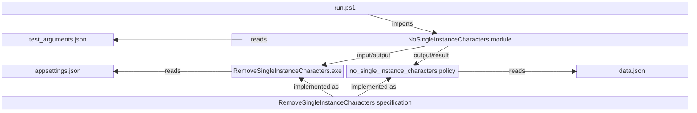

[](https://github.com/SignalRichard/dotnet-console-interview-example/actions/workflows/test.yaml)

# Interview Coding Example

This repository outlines an example interview coding exercise and provides example solutions, specifications, and validation.

## How to Use This Repository

Start by reading the [Example](#example) below or check out the [RemoveSingleInstanceCharacters.feature](features/RemoveSingleInstanceCharacters.feature) file, understand and think about the question and how you would implement a solution.

Start implementing your own solution in whatever language and framework you want.  If you complete your implementation, you can check its output against the [Validation Code](#validation-code).  You can call the [run.ps1](scripts/run.ps1) file and provide the application file path with your own application so long as it outputs the new string.

If you have trouble implementing a solution or want to review the sample implementation check out the [Example](#example) section.  Once you understand the solution you can look at the [specification](#formal-methodsspecification) section to see a more abstracted view of the algorithm and how formal methods can help you test the entire state space to help ensure the correctness of your algorithm.

## Example

Remove all instances of single (non-consecutive) even numbers from a string.

* `22 Park Avenue` => `22 Park Avenue`
* `21 Park Avenue` => `1 Park Avenue`
* `4ever` => `ever`
* `l8te` => `lte`
* `West 2nd Street` => `West nd Street`
* `11 * 8 = 88` => `11 *  = 88`
* `vet0` => `vet`

Good questions for you to ask, verify, and think about are:

* Zero will be considered an even number, correct?
* Single instance numbers means individual characters, not numbers composed of multiple individual numbers
* You do not need to parse the numbers to determine if they are even - this is a very limited set (5 numbers) that can be hard coded

## Getting Started

### Prerequisites

The following tooling is required to fully run all code in the repository:

* `dotnet` - build and test the sample implementation
* `opa` - run and test the validation implementation
* `PowerShell` - run the automated testing script
* `TLA Toolbox` - run the specification model
  * `Java` - required to run the TLA Toolbox

The following optional tooling is also used:

* `regal` - OPA/Rego linting
* `Pester` - PowerShell module for unit testing
* `Psake` - PowerShell module automation tool
* `PSScriptAnalyzer` - PowerShell module for linting

### Quickstart



To run the PowerShell commands, first run `Import-Module -Name './scripts/NoSingleInstanceCharacters`

To build the sample implementation, run `Build-Solution` from the repository root to build the sample implementation.

If you have `opa`, and `PowerShell` installed you can run the [run.ps1](scripts/run.ps1) script from the repository root and it will run the OPA server and run the console application with a set of predefined inputs that will get validated by calling the OPA server.

`./scripts/run.ps1`

The test inputs can be changed by updating the [test_arguments.json](scripts/test_arguments.json) file.

You can also pass your own executable/application file path to the script so that it will use your implementation instead of the sample.

`./scripts/run.ps1 -ApplicationFilePath "<full-path-to-my-exe>"`

To run the PowerShell Pester tests, run `Test-Script` from the repository root.

> If the command `Invoke-Pester` is not found, ensure you have installed the `Pester` module either directly of via the [requirements.psd1](requirements.psd1) using `PSDepend` (see [Install-Dependencies.ps1](scripts/Install-Dependencies.ps1) for PowerShell setup).

### Dev Container

This repository also supports the use of Dev Containers which integrates into VS Code.  In VS Code with the "Dev Containers" extension installed you can reopen this repository in a development container which will be built with all the necessary tools, including `dotnet`, `PowerShell` (with module dendencies), `Open Policy Agent`, and `TLA+`.

> To use Dev Containers with this repository requires VS Code + Dev Containers extension and Docker Desktop (+ WSL on Windows).


## Code Overview

The following sections provide overviews of the different sections of code and how to use them.

## Sample Implementation

The sample implementation is written in C# and can be found in the [Extensions.cs](src/RemoveSingleInstanceCharacters/Extensions.cs) file.

To build the implementation, run `dotnet build` (or `Build-Solution`) from the repository root.

A console application will be created under the project directory, `src/RemoveSingleInstanceCharacters/bin/Debug/net8.0/RemoveSingleInstanceCharacters.exe`.  You can run this console application with an argument and will output the result.

`RemoveSingleInstanceCharacters.exe "test 123"`

The single instance characters that are removed can be changed by updating the [appsettings.json](src/RemoveSingleInstanceCharacters/appsettings.json) file.

To run the unit tests, run `dotnet test` (or `Test-Solution`) in the repository root.

### Validation Code

The validation code implementation is written in Rego and can be found in the [no_single_instance_characters.rego](policy/no_single_instance_characters/no_single_instance_characters.rego) file and run using Open Policy Agent (OPA).  Rego excels at codifying policies and verifying structured JSON inputs.  To run OPA stand alone from the repository root:

`opa run --server ./policy/no_single_instance_characters/no_single_instance_characters.rego ./policy/no_single_instance_characters/data.json`

The OPA server instance is hosted locally at [http://localhost:8181](http://localhost:8181)

and you can hit the individual policy by using a POST request to the following route:

[/v1/data/no_single_instance_characters/valid](http://localhost:8181/v1/data/no_single_instance_characters/valid)

The body must be structured as JSON as follows:

```
{
    "input": {
        "str": "example"
    }
}
```

You can use this as a validation system for writing your own implementations of the algorithm by passing your result to OPA to check!

The single instance characters that are checked can be changed by updating the [data.json](policy/no_single_instance_characters/data.json) file.

To run the policy tests, run `opa test . -v` inside the `/policy` folder or run `Test-Policy` from the repository root.

### Formal Methods/Specification

There is also an implementation of this algorithm written as a specification using PlusCal/TLA+ and can be found in the [RemoveSingleInstanceCharacters.tla](spec/RemoveSingleInstanceCharacters/RemoveSingleInstanceCharacters.tla) file.  The specification abstracts the problem into ensuring that given a set of characters that should not have only single instances, it removes them and then verifies the result of the algorithm covering all permutations of the state space.

This specification is used to ensure the correctness of the algorithm, create the sample implementation, as well as create the sample validation logic.

> Note: the algorithm specification is written in PlusCal and translated to TLA+

To run the model checker you can open the spec using the TLA Toolbox and then run the associated model.  Or in VS Code with the TLA+ (Temporal Logic of Actions) extension you can run the `TLA+: Parse module` action from the command palette and then run `TLA+: Check model with TLC` with the specification file open.
